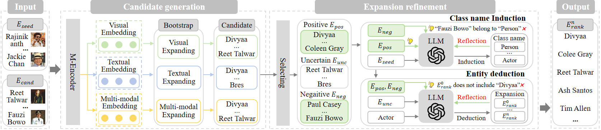

# VLExpan
This is the official github repository for the paper "VLExpan: A Visual-Enhanced LLM Framework with Inductive and Deductive Policy for Entity Set Expansion".

We present the source code release the NERD-Img dataset.

## Contents

- [VLExpan](#VLExpan)
  - [Contents](#contents)
  - [Overview](#overview)
  - [Dataset](#Dataset)
  - [Data procession](#Data-procession)
  - [Pretraining and Expanding](#Pretraining-and-Expanding)
  - [Class name induction](#Class-name-induction)
  - [Entity deduction](#Entity-deduction)

## Overview


Our proposed VLExpan consists of four key steps: (1) entity representation, (2) expanding and selecting (3) class name induction and (4) entity deduction.

## Dataset
The entity, courpus, query and ground truth of NERD-Img dataset can be found in "src/data/NERD/". 
Due to the anonymous policy, the all image resource will be released in Google Driver after anonymous restriction. We give some cases in "image-crawler". 

## Data procession
Run the following instruction to tokenize the corpus, which returns 'entity2sents_beit3.pkl'.
```python
>>> pyton -u src/make_entity2sents_beit3.py
```

## Pretraining and Expanding
First download the pretrained BEIT-3 parameters.
Then run the following script to pretrain the BEIT-3 and obtain three kinds of expansion results.
```
>>> bash beit3_pretrain_NERD.sh
```
In the script '-pretrain' means pretraining, '-make_dist' means embedding, '-test' means expanding.

## Selecting
Run the following instruction to select the positve (become_first.json) and negative (negative_cases.json) entities from the expansion results.
```
>>> python -u selecting.py
```

## Class name induction
First put your ChatGPT API into the following '.py' file
Then run the following instruction to induce the class name 
```
>>> python -u chatgpt_classname_NERD.py # initial class name
>>> python -u chatgpt_classname_correction_NERD # Reflection
```

## Entity deduction
First put your ChatGPT API into the following '.py' file
Then run  the following instruction to obtain the final expansion
```
>>> python -u chatgpt_rerank_clsname_cls_correct_rerank_rerank_correction_NERD.py 
```
